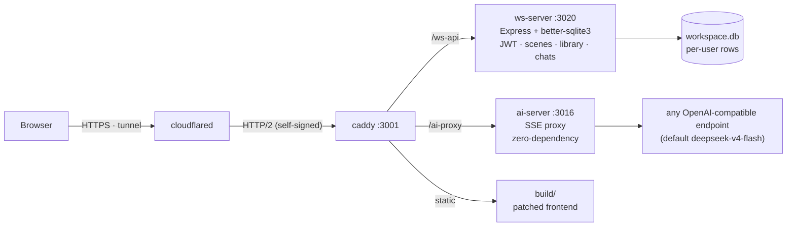
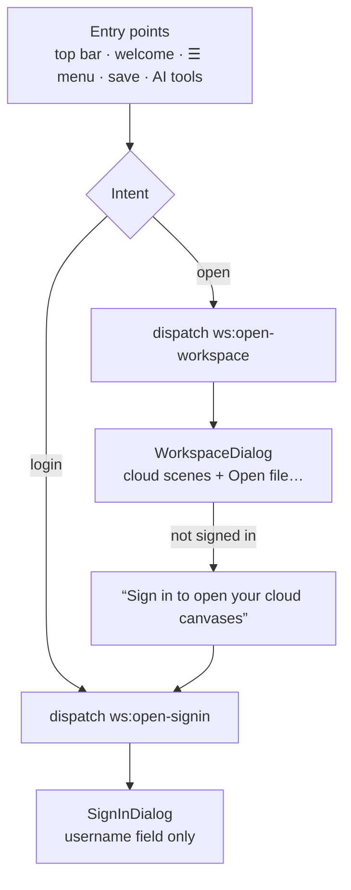
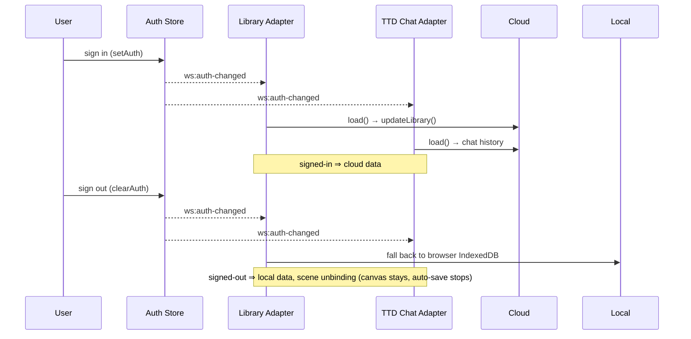

<p align="center">
  
</p>

<h1 align="center">excalidraw-selfhost</h1>

<p align="center">
  <b>The Excalidraw+ experience, fully self-hosted.</b><br>
  Sign in, cloud scenes, cloud library & AI text-to-diagram — without the subscription, without the SaaS.
</p>

<p align="center">
  <a href="https://github.com/Thunsis/excalidraw-selfhost/blob/main/LICENSE"></a>
  <a href="#"></a>
  <a href="#">= 24"></a>
  <a href="https://github.com/Thunsis/excalidraw-selfhost"></a>
</p>

<p align="center">
  <a href="#features">Features</a> ·
  <a href="#quick-start">Quick Start</a> ·
  <a href="#architecture">Architecture</a> ·
  <a href="#ux--auth">UX & Auth</a> ·
  <a href="#project-layout">Layout</a> ·
  <a href="#data--privacy">Privacy</a> ·
  <a href="#faq">FAQ</a> ·
  <a href="#scope">Scope</a> ·
  <a href="#license">License</a>
</p>

---

## Why

Excalidraw stores everything in browser storage. [Excalidraw+](https://plus.excalidraw.com) — the official paid tier — adds cloud sync, but it's SaaS with no self-host path (see [excalidraw/excalidraw#1772](https://github.com/excalidraw/excalidraw/issues/1772), open since 2020).

Existing self-host projects (alswl/excalidraw-collaboration et al.) focus on **real-time collaboration**. This project fills the other gap: a **personal cloud workspace** — your scenes, your library, your AI assistant, on your own infra. All data stays on your machine.

## Features

| | excalidraw-selfhost | alswl/excalidraw-collaboration | Excalidraw+ (paid) |
|---|---|---|---|
| **Sign in** (username as key) | ✅ | ❌ | ✅ |
| **Cloud scenes** (per-user, SQLite) | ✅ | ❌ | ✅ |
| **Cloud library sync** | ✅ | ❌ | ✅ |
| **AI text-to-diagram** (self-hosted) | ✅ | ❌ | ✅ |
| **HTTPS by default** (auto-redirect + HSTS) | ✅ | ❌ | ✅ |
| Real-time collaboration | ❌ (out of scope) | ✅ | ✅ |
| **Data ownership** | ✅ 100% | ✅ | ❌ |

> **Scope**: this is a **personal cloud** tool — one user's drawings, library & AI, synced across devices, fully owned. Real-time multi-user collaboration is deliberately out of scope.

- **Single-source monorepo** — the upstream Excalidraw repo stays pristine; customization lives as a versioned patch set (`patch/`), applied at build time.
- **Clean UX architecture** — login and workspace-open are decoupled into two intent events and two dialogs, all driven by one auth store.
- **Zero-config backends** — Express + SQLite; no external services required.
- **WAL-safe backups & healthcheck** — `make backup`, `make check`, cron-friendly.
- **Tunnel-ready** — Cloudflare Tunnel support for private HTTPS access without opening ports.

## Quick Start

> **Requirements**: macOS (launchd) · Node ≥ 24 · a local clone of [excalidraw/excalidraw](https://github.com/excalidraw/excalidraw) (pinned `1acf66e`) · optional Cloudflare account

```bash
git clone https://github.com/Thunsis/excalidraw-selfhost.git
cd excalidraw-selfhost

cp .env.example .env            # fill in your values
make install --dry-run          # preview generated configs in deploy/generated/
make install                    # symlink launchd agents + configs
```

Then bootstrap the frontend (one-time, per Excalidraw repo):

```bash
cd /path/to/excalidraw          # pinned commit 1acf66e
git apply /path/to/excalidraw-selfhost/patch/excalidraw.patch
cp -R /path/to/excalidraw-selfhost/patch/new/ .
corepack yarn build             # → excalidraw-app/build/ (served by caddy)
```

Finally start the services (or reboot — `RunAtLoad` picks them up):

```bash
for job in ws-backend ai-backend caddy cloudflared; do
  launchctl bootstrap gui/$(id -u) ~/Library/LaunchAgents/com.excalidraw.$job.plist
done
```

Open `https://localhost:3001` (or your tunnel domain) and sign in with any username.

### Frontend development workflow

Patches are the **single source of truth**. The Excalidraw repo stays clean (0 uncommitted changes):

```bash
make build            # restore → patch → build → restore (in the excalidraw repo)
make patch-export     # after editing code: re-export excalidraw.patch + new/
```

### Auth model

Deliberately simple: **username IS the credential** — no passwords, registration closed. Perfect for private self-hosting; **do not expose to the public internet** without adding real auth.

## Architecture



- **ws-server** (3020) — JWT auth, scenes CRUD, per-user key-value data (library, AI chats), share links. Express + better-sqlite3.
- **ai-server** (3016) — SSE proxy for Excalidraw's Text-to-Diagram → any OpenAI-compatible endpoint (default `deepseek-v4-flash` via opencode.ai).
- **caddy** (3001) — serves the patched frontend build + reverse-proxies `/ws-api` and `/ai-proxy`. Self-signed HTTPS for HTTP/2, **auto-redirects plain HTTP to HTTPS** (via `Cf-Visitor`) and sends **HSTS** so browsers pin the secure connection.
- **cloudflared** — optional Cloudflare Tunnel: no open ports, no DNS setup.

## UX & Auth

The frontend's cloud UX is built on three deliberate design decisions.

### 1. One auth store — the single source of truth

All token reads go through a module-level auth store (`workspaceCloud.ts`: `getToken` / `setAuth` / `clearAuth`). No component reads `localStorage` directly — sign-out can only happen through the UI, so every consumer stays consistent by construction.

### 2. Two intents, two dialogs

"Sign in" and "Open workspace" are different jobs, so they are separate events and separate dialogs:



- `ws:open-signin` → **SignInDialog** (pure login — no scene list, no file UI).
- `ws:open-workspace` → **WorkspaceDialog** (cloud scenes with remove, plus Open file…).
- All 15 entry points (top bar, welcome screen, hamburger menu, Save to Cloud, command palette, AI tools…) dispatch the *right* intent instead of one generic panel.

### 3. Library & AI follow the login state



Login pulls cloud library & AI chats in; sign-out falls back to local IndexedDB and unbinds the current scene — the canvas keeps its content but stops auto-saving to the cloud.

## Project Layout

```
apps/            deployable applications (each self-contained)
  ws-server/     cloud workspace backend (Express + better-sqlite3 + JWT)
  ai-server/     AI text-to-diagram SSE proxy
patch/           frontend customization delta (excalidraw.patch + new/)
deploy/          platform-specific assembly (launchd / caddy / cloudflared)
scripts/         ops toolchain (install / apply-patch / build / backup / healthcheck)
docs/            upgrade guide, troubleshooting
Makefile         unified entry point (make install / build / patch / backup / check / doctor)
```

## Data & Privacy

- **All user data lives in SQLite** at `apps/ws-server/data/` (default `WS_DATA_DIR`) — scenes, library, chat history, users.
- That directory is **gitignored** (`.gitignore: apps/ws-server/data/`) — your drawings never enter the repo or GitHub.
- JWT secret auto-generates on first run at `<WS_DATA_DIR>/.jwt-secret` (mode `600`), persists across restarts.
- `make backup` — WAL-safe snapshot, keeps last 7. `make check` — healthcheck (silent when healthy, cron-friendly).

## FAQ

**Why not just use alswl/excalidraw-collaboration?**
Different goal. That project is built for real-time multi-user collaboration; this one is a **personal cloud** — your scenes, library and AI synced across your own devices. If you need collab, that project is the right choice; this one isn't trying to be it.

**Why is "Sign in" separate from "Open"?**
Because they are different actions with different failure modes. A clean login dialog (username only) removes friction, while the workspace dialog is about your scenes — and when signed out it says so and offers a sign-in link instead of showing a confusing empty list.

**Why PolyForm Noncommercial?**
Personal and non-commercial use is free; commercial use requires a license. The patched frontend still contains MIT-licensed upstream code (see [LICENSE](LICENSE)).

**Can I use a different AI backend?**
Yes — any OpenAI-compatible endpoint. Set `OPENAI_BASE` / `MODEL` / `OPENAI_API_KEY` in `.env`.

**Is my data backed up?**
`make backup` snapshots the SQLite DB WAL-safely (works while running) and keeps 7 generations. Pair with cron for daily backups.

**How do I upgrade when Excalidraw upstream moves?**
Deliberately slow (quarterly). See [docs/upgrade.md](docs/upgrade.md) — pull, resolve conflicts by hand, re-export the patch.

## Scope

This project is built around a single, clear goal: **your personal Excalidraw cloud**. One user, their scenes, their library, their AI — synced across devices, owned entirely by them.

Explicit non-goals (no plans to add):

- Real-time multi-user collaboration — use [alswl/excalidraw-collaboration](https://github.com/alswl/excalidraw-collaboration) if you need it.
- Multi-tenant SaaS / public hosting — usernames are the only credential, by design.

The codebase stays small and focused: a personal cloud is a solved problem in ~1,000 lines across two backends; adding collaboration would double the surface and complexity for a scenario this project doesn't target.

## License

[PolyForm Noncommercial 1.0.0](LICENSE) — © 2026 Thunsis. Personal & non-commercial use free; commercial use requires permission. Upstream Excalidraw code remains MIT-licensed.
